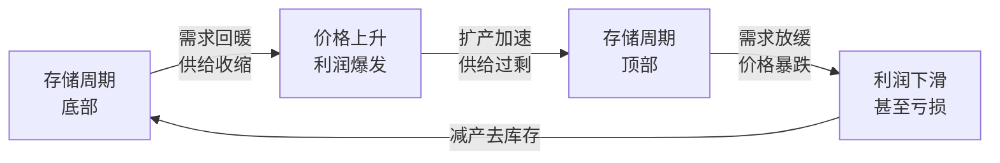
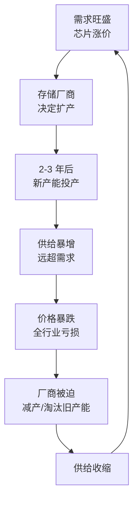
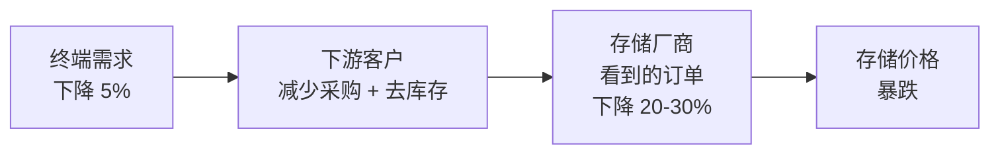
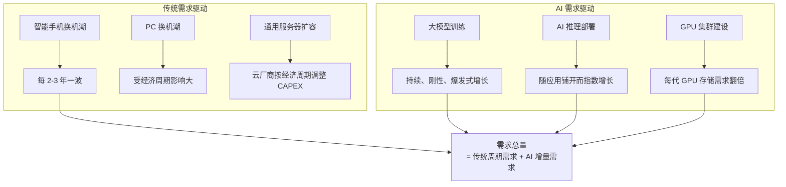
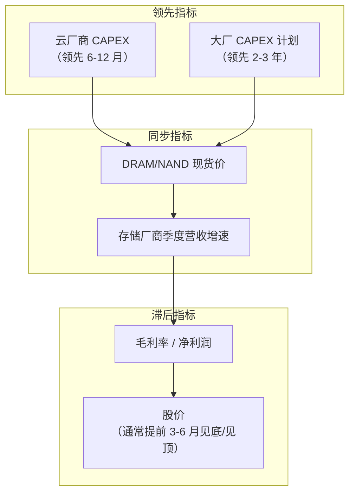
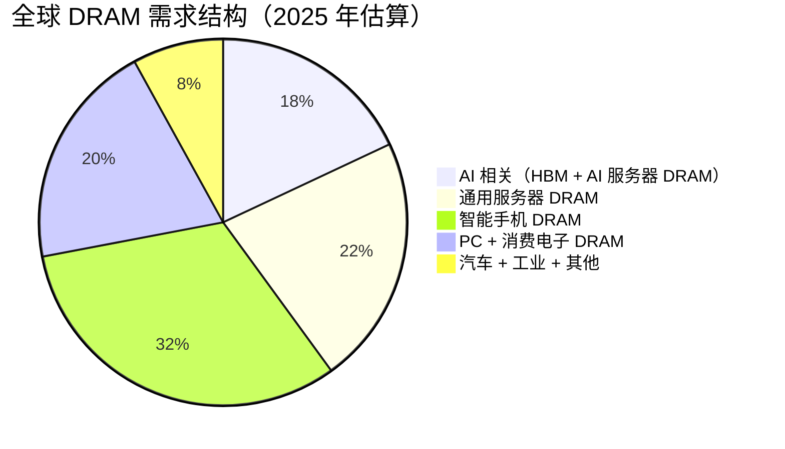
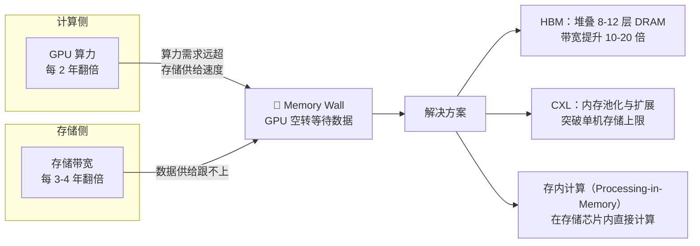

# 存储板块是周期股吗？为什么？如何把握？

## 一、先说结论

> **存储板块是半导体行业中最典型的强周期板块，且周期波动的剧烈程度远超其他半导体细分领域。**

存储芯片（DRAM 内存、NAND Flash 闪存）的价格可以在一年内翻倍，也可以在一年内腰斩。以美股美光科技（MU）为例：2023 年股价从低点 $48 涨至 2024 年高点 $157，涨幅超 200%；而在 2022 年，同样的 MU 从 $98 跌至 $48，腰斩有余。韩股三星电子、SK 海力士同样如此——这就是周期股的典型特征。

但"是周期股"并不意味着"不能投资"。恰恰相反，**理解周期的规律，在周期底部买入、在周期顶部卖出，是存储板块最核心的投资逻辑。**



## 二、先理解：什么是周期股？

### 2.1 周期股的定义

**周期股**（Cyclical Stock）是指公司业绩和股价与经济周期或行业供需周期高度相关的股票。这类公司的产品价格、销量、利润会随着周期大幅波动，而不是稳定增长。

| 特征 | 周期股 | 非周期股（防御型） |
|------|--------|-------------------|
| **业绩波动** | 大起大落，利润可能从暴赚到亏损 | 相对稳定，温和增长 |
| **与经济关系** | 强相关，经济好时爆发，经济差时暴跌 | 弱相关，无论经济好坏需求都在 |
| **产品特征** | 同质化、标准化、价格由供需决定 | 差异化、品牌化、有一定定价权 |
| **典型代表** | 存储芯片、钢铁、航运、石油 | 食品、医药、公用事业 |
| **投资逻辑** | 买在周期底部，卖在周期顶部 | 长期持有，赚业绩增长的钱 |

### 2.2 周期股 vs 成长股——一个关键区别

很多人容易把"高增长"和"成长股"划等号。但存储行业是一个经典的反例：

- 存储行业在上升期利润增速可以达到 100% 甚至 200%，看起来非常"成长"
- 但这不是因为公司变强了，而是因为**存储芯片涨价了**
- 当周期反转，同样的公司可能利润暴跌 80% 甚至亏损

> **真正的成长股靠的是"护城河变宽"（技术壁垒、品牌、网络效应），周期股靠的是"风来了"（供需关系阶段性有利）。**

## 三、存储行业为什么是强周期行业？

存储行业的周期性根植于三个核心矛盾：

### 3.1 矛盾一：产品高度同质化 → 价格是唯一竞争维度

DRAM 和 NAND Flash 是高度标准化的产品。三星的 DDR5 内存条和美光的 DDR5 内存条，在性能上几乎没有区别——它们都遵循 JEDEC 标准。

```
DRAM 芯片的特征：
├── 标准化接口（JEDEC 规范）
├── 性能指标统一（频率、时序、容量）
├── 不同厂商产品可以互换
└── → 竞争几乎完全围绕【价格】
```

这意味着：当供给过剩时，厂商**只能通过降价来争夺市场份额**。没有品牌溢价、没有技术独占性来支撑价格。价格战一旦开打，很容易杀到全行业亏损。

这就像**大宗商品**（石油、铜、钢铁），而不是像**品牌消费品**（茅台、苹果）。

### 3.2 矛盾二：供给刚性 → 产能调整严重滞后

存储芯片制造是全世界最复杂的制造工艺之一：

| 制造特征 | 影响 |
|----------|------|
| **建厂周期 2-3 年** | 从决定扩产到新产能投产，中间隔着 2-3 年 |
| **单厂投资 100-200 亿美元** | 一旦建厂，即使亏钱也很难停产（沉没成本巨大） |
| **产线必须连续运转** | 停机再重启的成本极高，即使亏损也要维持生产 |
| **技术迭代快** | 1-2 年一代新工艺，旧产能必须折旧完才能淘汰 |



> 这就是存储周期的核心机制：**需求变化快，供给调整慢。** 当需求起来时，供给跟不上，价格暴涨；当供给终于跟上时，需求可能已经见顶，价格暴跌。

### 3.3 矛盾三：需求高度依赖下游景气 → 放大器效应

存储芯片的下游需求高度集中于三大领域：

| 下游领域 | 占比（估） | 周期性特征 |
|----------|:--------:|-----------|
| **智能手机** | ~30% | 换机周期、消费意愿 → 中等周期性 |
| **服务器/数据中心** | ~40% | 云厂商 + AI 资本开支 → 强周期性，但 AI 需求正在改变结构 |
| **PC 及消费电子** | ~20% | 换机周期 → 中等周期性 |
| **汽车/工业** | ~10% | 相对稳定 |

问题在于：**这三大主力需求都有周期性。** 当经济下行时，消费者不换手机、企业砍 IT 预算、云厂商缩减资本开支——存储需求同时受到三重打击。

更糟的是，还有一个**牛鞭效应**（Bullwhip Effect）：



下游客户在需求疲软时，不仅减少采购，还会**主动消耗库存**（因为囤的芯片还在贬值）。这两个因素叠加，使存储厂商感受到的需求波动被放大了数倍。

### 3.4 AI 时代的新变量：需求结构正在被改写

以上是存储行业**过去三十年**的经典剧本。但 **AI 时代的到来正在引入一个全新的需求变量**——它和传统需求有本质不同：



**AI 需求与传统需求的三个关键差异：**

| 维度 | 传统存储需求 | AI 存储需求 |
|------|-------------|------------|
| **驱动因素** | 消费者换机意愿、企业 IT 预算 | 大模型 Scaling Law、AI 应用渗透率 |
| **周期性** | 强周期性，随宏观经济波动 | **目前处于早期爆发阶段，呈现刚性增长特征** |
| **存储类型** | DDR4/DDR5 内存、TLC/QLC NAND | HBM、大容量 DDR5、高速 SSD |
| **增长斜率** | 与 GDP/消费电子出货量同步（低个位数） | 每年 50-100% 增长（远超传统存储） |
| **定价模式** | 大宗商品，供需定价 | HBM 为长约 + 溢价定价，传统 DRAM 仍为大宗商品 |

> **核心洞察**：AI 并没有消除存储的周期性，但它正在**制造一个"周期中的非周期层"**——HBM 等 AI 专用存储享受结构性供不应求，而传统 DDR4/NAND 仍然在周期中沉浮。这导致存储行业内部出现前所未有的**结构分化**。

## 四、美股/韩股存储核心标的

全球存储芯片行业高度集中，基本上就是三家原厂 + 配套设备商的格局。投资存储周期，主要关注以下标的：

### 4.1 存储原厂（IDM）—— 周期弹性最大

| 公司 | 代码 | 市场 | DRAM 全球份额 | NAND 全球份额 | 特点 |
|------|------|------|:----------:|:----------:|------|
| **三星电子** | 005930.KS | 韩股 KOSPI | ~42% | ~35% | 全球存储霸主，DRAM+NAND 双料第一，但存储只占其营收 ~30%（还有手机、家电等），纯存储弹性不如美光 |
| **SK 海力士** | 000660.KS | 韩股 KOSPI | ~28% | ~18% | DRAM 老二，HBM 市占率全球第一（供英伟达），AI 存储核心标的 |
| **美光科技** | MU | 美股 NASDAQ | ~23% | ~12% | **全球最纯的存储标的**（DRAM+NAND 占比超 90%），波动率极高，是博弈存储周期的首选美股 |
| **西部数据** | WDC | 美股 NASDAQ | — | ~15% | NAND Flash 为主（通过铠侠合资），兼做 HDD 硬盘，周期弹性不如美光但波动仍大 |

### 4.2 存储设备商 —— 间接受益于周期

| 公司 | 代码 | 市场 | 业务关联 |
|------|------|------|----------|
| **应用材料** | AMAT | 美股 NASDAQ | 全球最大半导体设备商，存储厂扩产时 CAPEX 大增，AMAT 直接受益 |
| **泛林半导体** | LRCX | 美股 NASDAQ | 刻蚀设备龙头，存储制造对刻蚀环节需求极高 |
| **东京电子** | 8035.T | 日股 TSE | 涂布显影 + 刻蚀，深度绑定三星、海力士供应链 |

> **弹性排序**：存储原厂（MU / 三星 / 海力士）> 存储设备商（AMAT / LRCX）> 半导体 ETF。如果想**纯粹博弈存储周期**，美光科技（MU）是最佳美股标的；如果想**兼顾 AI + 存储**，SK 海力士（000660.KS）是最佳韩股标的。

## 五、存储周期的历史回顾：残酷的轮回

### 5.1 近十年完整周期

| 周期 | 上行驱动 | 下行驱动 | MU 股价表现 | 三星存储部门表现 |
|------|----------|----------|-------------|-----------------|
| **2016-2019** | 智能手机升级 + 云服务器扩容 | 产能集中释放 + 手机见顶 | $10 → $60 → $30 | 营收 +74% 到 -34% |
| **2020-2023** | 疫情远程办公 + 5G | 通胀加息 + 消费电子崩盘 | $40 → $98 → $48 | 利润从暴赚到亏损 |
| **2023-2025** | AI 算力爆发（HBM） | 传统存储仍去库存 | $48 → $157 → 回调 | 部门利润创历史新高 |
| **2025-至今** | AI 数据中心扩容 + HBM 扩产 | 待观察 | 待观察 | 待观察 |

### 5.2 一个典型的存储周期时间线

以 2020-2023 这轮周期为例，历时约 3-4 年：

```
阶段 1: 周期底部（约 6-12 个月）
├── 全行业亏损或微利（2022Q4-2023Q1 MU 单季亏损达 $23 亿）
├── 厂商减产、关停旧产线
├── 库存持续下降
├── 股价处于低位（MU 跌至 $48）
└── 信号：大厂宣布减产 + 库存天数下降

阶段 2: 复苏初期（约 6-9 个月）
├── 下游需求开始回暖（AI 服务器订单爆发）
├── 库存降到正常水平以下
├── 存储芯片开始涨价（温和，DRAM 现货价月涨 5-10%）
├── 股价开始从底部反弹（MU $48 → $70）
└── 信号：现货价格连续 2-3 个月上涨

阶段 3: 繁荣期（约 12-18 个月）
├── 供给紧张，HBM 价格溢价 3-5 倍于传统 DRAM
├── 厂商利润爆发（MU FY2024 净利润接近 $50 亿）
├── 股价大幅上涨（MU $48 → $157，涨逾 200%）
├── 三星、海力士、美光纷纷宣布扩产
└── 信号：大厂宣布扩建新厂 + 价格加速上涨

阶段 4: 见顶反转（约 3-6 个月）
├── 供给开始释放 + 需求增速放缓
├── 存储芯片价格开始松动
├── 库存开始重新堆积
├── 股价先于基本面见顶
└── 信号：大客户砍单 + 库存天数重新上升
```

## 六、如何把握存储周期？（实操指南）

### 6.1 核心原则：逆周期投资

存储板块的投资铁律只有一句话：

> **在所有人都悲观的时候买入，在所有人都乐观的时候卖出。**

| 周期阶段 | 市场情绪 | 新闻头条典型 | 你应该 |
|----------|----------|-------------|--------|
| **底部** | 极度悲观 | "存储寒冬来临"、"美光宣布裁员减产"、"三星利润暴降 95%" | **开始分批买入** |
| **复苏** | 将信将疑 | "DRAM 价格止跌企稳"、"库存天数降至正常以下" | **加仓** |
| **繁荣** | 一片乐观 | "存储超级周期来了"、"分析师上调目标价至新高" | **持有观望，不追高** |
| **顶部** | 疯狂乐观 | "存储黄金十年"、"这次不一样，AI 改变一切" | **逐步卖出** |

### 6.2 跟踪哪些核心指标？

要把握存储周期，持续跟踪以下**先行指标**：

#### 指标一：DRAM / NAND 现货价格（最直接）

- 数据来源：TrendForce（集邦咨询）DRAMeXchange 每周报价；CFM 闪存市场
- **怎么看**：价格的**方向**比绝对值重要。连续两个月上涨（或下跌），趋势基本确立
- 关注：DDR5 16Gb 现货价、NAND 512Gb TLC 晶圆价

#### 指标二：库存天数（最关键、最可靠）

- 数据来源：MU / 三星 / SK 海力士 季度财报
- **怎么看**：

| 库存天数 | 含义 | 操作信号 |
|:--------:|------|----------|
| > 130 天 | 严重过剩，周期底部附近 | 🟢 开始关注，准备买入 |
| 100-130 天 | 供过于求 | 🟡 持有观望 |
| 80-100 天 | 正常水平 | 🟡 持有 |
| 60-80 天 | 供给偏紧 | 🟠 持有，密切跟踪 |
| < 60 天 | 供给紧张，繁荣期 | 🔴 准备逐步卖出 |

#### 指标三：大厂资本开支（CAPEX）—— 领先 2-3 年的最强信号

- 看三星、SK 海力士、美光季度财报中的 CAPEX 指引
- **怎么看**：

| CAPEX 变动 | 信号含义 |
|-----------|----------|
| **大幅削减**（同比 -30% 以上） | 🟢 周期底部信号：供给将在 2-3 年后收缩，为下一轮涨价蓄力 |
| **温和增长**（同比 +10%~20%） | 🟡 正常扩张 |
| **大幅增加**（同比 +30% 以上） | 🔴 周期顶部信号：未来 2-3 年大量新产能释放，价格承压 |

#### 指标四：下游需求景气度（领先 6-12 个月）

- 全球智能手机季度出货量（IDC / Counterpoint）
- 全球服务器出货量（TrendForce）
- 北美三大云厂商（AWS / Azure / GCP）资本开支合计
- **怎么看**：下游需求增速拐点是存储需求的**先行指标**，提前 6-12 个月预示方向



### 6.3 如何执行交易？（美股/韩股操作参考）

#### 买入阶段（周期底部→复苏初期）

| 信号确认 | 操作 |
|----------|------|
| MU 或三星库存天数从 130+ 天开始下降 | 开始小仓位建仓 |
| DRAM 现货价连续 2 个月环比上涨 | 加仓至目标仓位 50% |
| 公司财报中确认"价格企稳、需求回暖" | 加仓至目标仓位 80% |
| 季度营收恢复正增长 | 满仓持有 |

#### 卖出阶段（繁荣→顶部）

| 信号确认 | 操作 |
|----------|------|
| 券商报告开始喊"超级周期"、"黄金十年" | 🚨 警惕，不要再加仓 |
| MU 或三星宣布大规模新厂建设计划 | 开始减仓 20-30% |
| DRAM 价格仍在涨但 MU 股价已横盘 2-3 个月不创新高 | 再减 30-40% |
| 库存天数开始重新上升 | 清仓 |

### 6.4 最重要的事：别买在周期顶部

存储周期投资最大的风险是**在顶部误以为自己买的是"成长股"**。几个危险信号一定要警惕：

| 🚨 危险信号 | 真实案例 |
|-------------|----------|
| 券商给出"超级周期"、"黄金十年"的判断 | 2021 年底，多家券商喊存储"超级周期刚开始"，随后 MU 跌了 50%+ |
| MU PE 看起来"只有 8 倍，很便宜" | 那是因为利润在周期顶点！等利润暴跌后 PE 可能飙到 100 倍甚至变负数 |
| 三星/海力士/美光集体宣布大规模扩产 | 2-3 年后这些产能释放时，就是下一轮崩盘的弹药 |
| 价格还在涨，但股价已经不涨了 | 股价往往领先基本面 3-6 个月见顶，这是最重要的离场信号 |

## 七、AI 时代的存储：周期会消失吗？

这是当前存储投资最核心的命题。AI 的爆发式增长会否"熨平"存储周期？答案是：**不会消失，但会被深刻重塑。**

### 7.1 为什么 AI 不会让周期消失？

#### 7.1.1 AI 存储只占总需求的一部分（目前约 15-20%）

尽管 AI 存储需求增速惊人（年增 50-100%），但从绝对量看，AI 相关的存储（HBM + AI 服务器 DRAM + AI SSD）目前仅占全球存储市场的约 **15-20%**。剩余的 80% 仍然是传统周期性需求——智能手机、PC、通用服务器。



> 即使 AI 需求每年翻倍，如果剩余的 80% 传统需求因为经济衰退而下滑 15-20%，总需求仍可能是下降的。AI 目前规模还不足以完全对冲传统周期的下行。

#### 7.1.2 供给端的周期性没有改变

AI 需求再强，也无法改变一个物理事实：**建一座 DRAM 工厂需要 2-3 年，投资 150-200 亿美元。** 三大厂看到 HBM 赚钱后，都在疯狂扩产：

| 厂商 | HBM 扩产计划 | 风险 |
|------|-------------|------|
| **SK 海力士** | 2025-2027 年 HBM 产能翻 3 倍 | 如果 AI 投资热情降温，海量 HBM 产能将无处可去 |
| **三星电子** | 大幅扩产 HBM3E，追赶海力士 | 历史上三星经常在顶部扩产最凶，随后价格暴跌 |
| **美光科技** | HBM3E 从零到规模量产 | 起步最晚，存在技术追赶风险 |

历史规律不会因为 AI 而改变：**当三大厂同时大规模扩产，2-3 年后必然出现供给过剩。** 只不过这次过剩的可能不只是传统 DRAM，还可能包括 HBM——当英伟达的 GPU 出货增速放缓时，HBM 的需求增速也会随之放缓。

#### 7.1.3 AI 需求本身也有周期性

很多人默认"AI 投资只会一直增长"，但历史告诉我们：

- 每一轮技术浪潮都有**投资过热 → 预期落空 → 投资收缩**的周期
- 2022-2023 年的云计算 CAPEX 收缩就是前车之鉴
- 如果大模型的 Scaling Law 遇到瓶颈（模型变大但效果不再显著提升），AI 算力投资可能阶段性降温
- AI 应用的商业化落地如果不及预期，推理需求增速可能低于当前乐观预测

> **AI 不会消除周期，它只是给存储行业增加了一个高增长的结构性需求层。当这个需求层本身的增速出现波动时，叠加传统需求的周期，存储行业的波动甚至可能被放大。**

### 7.2 AI 如何深刻重塑存储行业？（结构性变化）

虽然周期不会消失，但 AI 确实在三个层面上**不可逆地改变了存储行业的结构**：

#### 变化一：HBM —— 从"大宗商品"到"战略物资"

HBM（High Bandwidth Memory，高带宽内存）是 AI GPU 的"贴身内存伴侣"。没有 HBM，GPU 的算力根本发挥不出来。

```
一块英伟达 H100 GPU 的存储配置：
├── HBM3：80GB（与 GPU 通过硅中介层直接封装在一起）
├── 配套系统 DRAM（DDR5）：约 2TB / 每 8 块 GPU
└── 存储需求对比：
    传统服务器：每 CPU 配 256-512GB DDR5
    AI 服务器：每 GPU 配 80GB HBM + 256GB 系统 DRAM
    → AI 服务器的存储价值量是传统服务器的 5-10 倍
```

HBM 与传统 DRAM 的关键差异：

| 对比维度 | 传统 DRAM（DDR5/DDR4） | HBM（HBM3/HBM3E/HBM4） |
|----------|------------------------|-------------------------|
| **应用场景** | 普通服务器、PC、手机 | AI GPU（英伟达 H100/H200/B200/Rubin） |
| **供需格局** | 经常供过于求 → 价格战 | 严重供不应求 → 客户预付款锁产能 |
| **定价模式** | 大宗商品式，现货价格每日波动 | 长期合约 + 定制化 + **溢价 3-5 倍于同容量 DDR5** |
| **客户集中度** | 极度分散（渠道、ODM、模组厂） | 高度集中（英伟达一家占 60%+） |
| **竞争格局** | 三星/海力士/美光三家均势 | **SK 海力士 > 50%，三星追赶，美光起步** |
| **毛利率** | 周期底部可低至 0-10%，顶部 50-60% | 预估 50-70%，且波动远小于传统 DRAM |

> **SK 海力士（000660.KS）是 HBM 时代的最大赢家。** 它凭借先发优势拿下了英伟达 HBM 供应的最大份额，从 DRAM 行业的"老二"变成了 AI 存储的"王者"。

#### 变化二：存储需求从"量"驱动变为"量+带宽"双驱动

传统存储需求增长主要靠**出货量**（更多手机、更多服务器）。AI 时代增加了一个新维度：**每台设备的存储密度和带宽需求在爆炸式增长**。

| 指标 | AI 时代之前 | AI 时代之后 |
|------|------------|------------|
| 服务器平均 DRAM 容量 | 256-512 GB | 1-2 TB（AI 服务器） |
| 存储带宽需求 | DDR4 25.6 GB/s → DDR5 51.2 GB/s | HBM3E 1.2 TB/s（提升 20 倍+） |
| 单位算力的存储需求 | 相对稳定 | **每代 GPU 配套存储翻倍**（H100: 80GB → B200: 192GB → Rubin: 预计 288GB+） |
| SSD 需求 | SATA SSD 为主 | NVMe 高速 SSD 成为 AI 数据处理瓶颈 |

> **关键结论：即使 AI 服务器出货量增速放缓，单机存储容量和带宽的升级换代仍会驱动存储需求增长。** 这为存储行业增加了一层"结构性增长"的底色，局部缓解了周期性。

#### 变化三：存储正在从"配角"变成 AI 算力的"瓶颈"

一个被大多数人忽视的事实：**AI 算力的真正瓶颈已经不是 GPU 的计算能力，而是存储带宽。**

这个问题在业界被称为 **"Memory Wall"（内存墙）**：



> **存储从"辅助角色"变成了 AI 基础设施的核心瓶颈。** 这带来的投资含义是：存储不再是那个"赚周期钱"的大宗商品行业，它正在成为 AI 价值链中不可或缺的一环。这可能会让市场愿意给存储公司更高的估值中枢——但前提是 AI 需求持续。

### 7.3 AI 时代的新跟踪指标

除了传统的 DRAM 现货价、库存天数、CAPEX 之外，AI 时代需要新增以下跟踪维度：

| 新指标 | 数据来源 | 怎么看 |
|--------|----------|--------|
| **英伟达 GPU 出货量** | 英伟达季度财报 | GPU 出货量 × 每 GPU HBM 容量 = HBM 需求下限 |
| **HBM 合同价 vs 现货溢价** | TrendForce / 产业链调研 | 溢价收窄 → HBM 供给开始追上需求，警惕 |
| **三大厂 HBM 产能占比** | 公司财报 / 券商研报 | HBM 产能占总 DRAM 产能比例越高 → 传统 DRAM 供给越紧 → 价格越坚挺 |
| **北美四大云厂商 AI CAPEX** | AWS/Azure/GCP/Oracle 财报 | AI 投资增速拐点 → 领先 HBM 需求 6-12 个月 |
| **AI 大模型参数规模趋势** | 公开信息（GPT-5、Gemini 3 等） | 模型参数增速放缓 → 训练需求见顶信号 |
| **CXL 生态成熟度** | 行业展会（如 OCP/MemCon） | CXL 大规模商用 → 存储架构变革 → 新增长极 |

### 7.4 行业集中度 → 周期波动可能收敛

过去 20 年，DRAM 行业从 20+ 家厂商整合到**仅剩 3 家**（三星 + SK 海力士 + 美光），合计份额超过 95%。

行业集中度大幅提高意味着：三大厂更有能力**协同调节供给**（一起减产撑价），而不是被动打价格战到全输。AI 时代进一步强化了这个趋势——HBM 的技术壁垒极高（需要先进的 TSV 硅通孔 + 堆叠封装），新玩家几乎无法进入。

- 传统 DRAM：三大厂寡占，供给纪律性增强 → 周期波动可能比历史上收敛
- HBM：实质上只有海力士 + 三星两家主力 → 供给极度可控，价格稳定性高

### 7.5 地缘政治风险——韩股特有变量

投资韩股存储标的（三星、SK 海力士），需要额外关注：

- 朝鲜半岛局势紧张 → 供应链中断风险（全球 HBM 产能几乎都在韩国）
- 三星西安 NAND 厂、海力士无锡 DRAM 厂 → 中美科技战可能波及
- 韩国可能被美国要求限制对华 HBM 出口 → 短期损失中国市场，长期利好美光
- 韩元汇率波动 → 韩元贬值会侵蚀美元计价投资收益

> **风控建议**：做多韩股存储时，宜对冲韩元汇率风险（韩元与科技周期高度正相关），或直接通过美股 **MU** 参与存储周期以规避地缘政治不确定性。如果看好 HBM 赛道但担心韩股地缘风险，**MU** 是目前美股中唯一的 HBM 替代标的。

## 八、总结

| 问题 | 答案 |
|------|------|
| **存储板块是周期股吗？** | **是，而且是半导体中最强周期的板块。** |
| **AI 能消除周期吗？** | **不能。** AI 存储只占总需求 ~15-20%，供给刚性没有改变，AI 投资本身也有周期。但 AI 为存储增加了一个高增长的结构性需求层。 |
| **AI 改变了什么？** | 三大结构性变化：① HBM 从大宗商品变为战略物资（长约+溢价）；② 单设备存储密度暴涨（每代 GPU 存储翻倍）；③ 存储从配角变成 AI 算力瓶颈（Memory Wall）。 |
| **周期多长？** | 历史上 3-4 年一轮，AI 时代周期长度可能缩短（因为 AI 需求增速更快，供需错配节奏更快）。 |
| **怎么把握？** | **逆周期投资 + 结构选择**：传统部分看周期指标（价格、库存、CAPEX），AI 部分看英伟达 GPU 出货和 HBM 溢价。底部买入，顶部卖出。 |
| **核心美股标的** | 美光科技（MU）— 最纯存储 + 美股唯一 HBM 标的；西部数据（WDC）；应用材料（AMAT）/ 泛林（LRCX）— 设备间接受益。 |
| **核心韩股标的** | SK 海力士（000660.KS）— HBM 之王，AI 存储最大受益者；三星电子（005930.KS）— 存储霸主但多元化，HBM 追赶中。 |
| **当前核心命题** | AI 驱动的 HBM 景气 v.s. 传统存储周期性下行——**存储行业的"分裂"是当前最大的投资主题。** 做多 HBM 结构性稀缺，做空传统 DRAM 周期性过剩，可能在同一个行业中同时成立。 |
| **最大风险** | ① 在周期顶部把周期股当成长股买；② 忽视 AI 投资本身的周期性（如果 Scaling Law 遇瓶颈，HBM 需求预期将大幅修正）；③ 韩股地缘政治风险。 |

> **核心心法：AI 时代的存储投资 = 理解周期的智慧 + 识别结构的眼光。** 传统存储仍然遵循"买在无人问津处，卖在人声鼎沸时"的周期铁律。而 AI 存储（HBM）更像是一张"结构性增长"的长期船票——关键是在周期底部拿到它，而不是在所有人都在谈论 AI 的时候追高买入。
