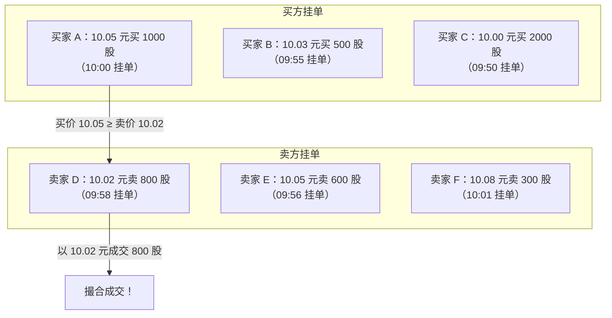
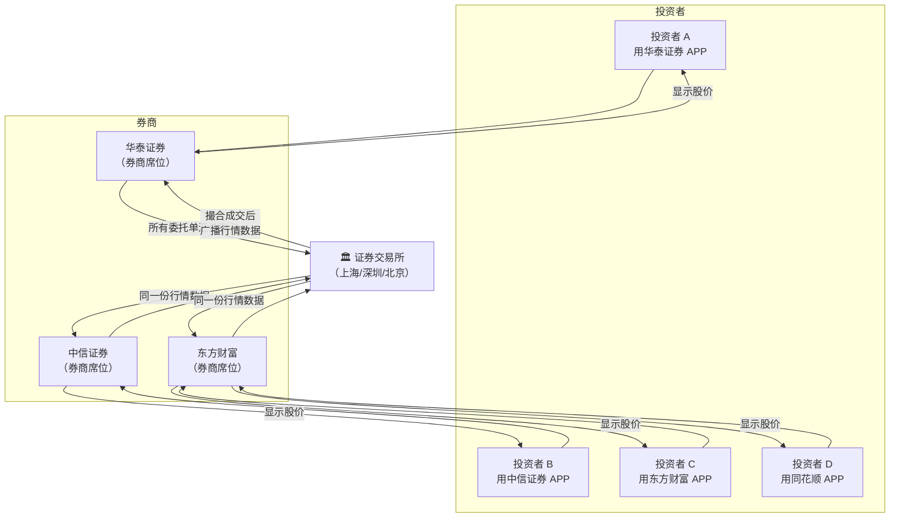
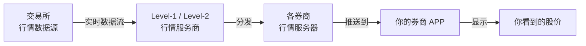
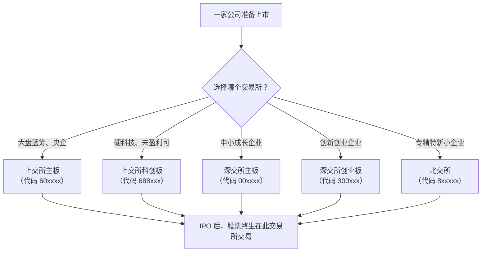
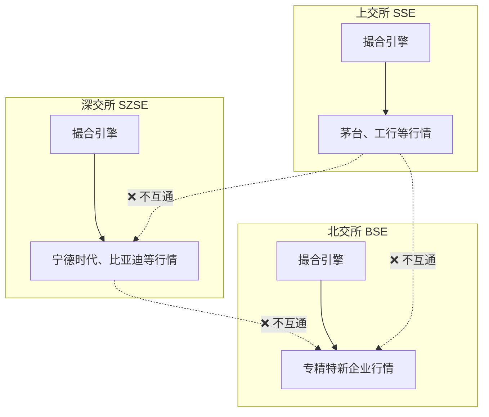
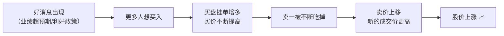
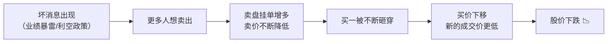
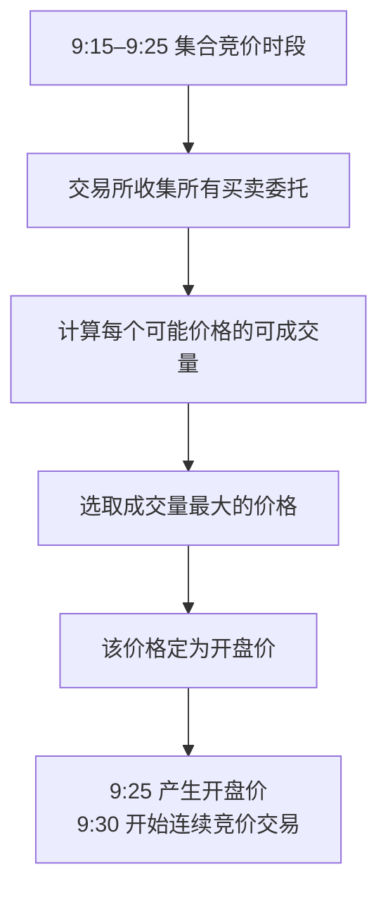
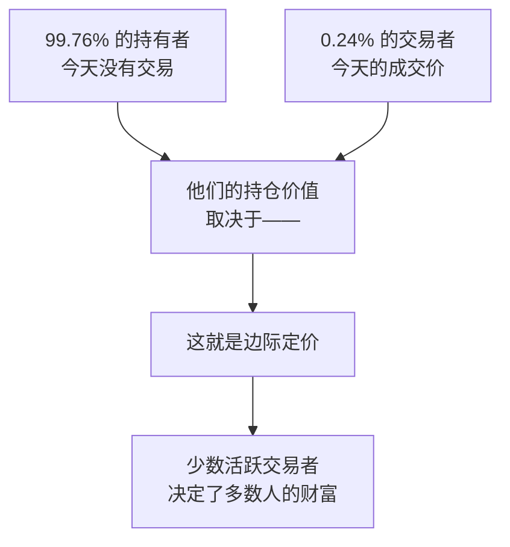

# 股价为什么会上涨和下跌？成交价到底怎么来的？

## 一、一个被忽视的根本问题

很多人炒股多年，却回答不上来一个最基本的问题：

> **股价到底是怎么变动的？是谁在"定价"？**

直觉上，你可能以为有一个"官方定价"或者交易所算出来的价格。但实际上，**没有任何人在"定价"——股价完全由买卖双方的博弈自然产生。**

这篇文章从最底层的交易机制讲起，帮你理解股价涨跌的根本原因。

## 二、股价的本质：一笔一笔"成交"出来的

### 2.1 股价不是一个"数字"，而是一连串成交记录

股票市场不是超市——没有标好的"售价"。你看到的股价（比如茅台 1800 元），其实是**最近一笔成交的价格**。

```
时间线：茅台今天的成交记录

09:30:01  → 以 1798 元成交 100 股
09:30:02  → 以 1799 元成交 500 股
09:30:03  → 以 1800 元成交 200 股  ← 此刻股价显示为 1800
09:30:04  → 以 1799 元成交 300 股  ← 股价又变成了 1799
```

> **股价 = 最近一笔成交的成交价。** 股价的每一次跳动，背后都是一笔真实的买卖交易。

### 2.2 成交价怎么来的？——撮合机制

交易所的核心工作就是**撮合**：把想买的人和想卖的人配对。但买卖双方出价往往不一样——你想 10 块买，我想 11 块卖，凭什么成交？

答案是**价格优先 + 时间优先**的撮合规则。



撮合的核心规则：

| 规则 | 说明 |
|------|------|
| **价格优先** | 买单出价高的优先成交；卖单出价低的优先成交 |
| **时间优先** | 价格相同时，先挂单的先成交 |

举一个具体的例子。假设当前"买一"是 10.00 元（有人愿意以 10.00 买入），"卖一"是 10.02 元（有人愿意以 10.02 卖出）：

- **如果你想立刻买入**：你可以直接按卖一的 10.02 元下单 → 立刻以 10.02 元成交 → 股价变成 10.02
- **如果你想立刻卖出**：你可以直接按买一的 10.00 元下单 → 立刻以 10.00 元成交 → 股价变成 10.00
- **如果你不着急**：你可以挂一个 10.01 元的买单等着 → 如果有人愿意以 10.01 元卖，就成交

## 三、股价背后的"中央系统"：交易所撮合引擎

### 3.1 为什么不同券商上的股价一模一样？

你可能用过多个券商 APP——同花顺、东方财富、华泰涨乐、中信证券——你会发现一个现象：

> **同一只股票，在所有券商 APP 上显示的股价、盘口、成交量完全一样，而且是实时同步的。**

这不是因为券商之间互相"对账"，而是因为它们都连接到了**同一个地方**。

### 3.2 交易所：唯一的"交易大厅"

股票交易的本质架构非常简单：



> **交易所是整个市场的"唯一中枢"。** 所有券商只是"通道"——它们把你的委托单送到交易所，交易所撮合成交后，再把行情数据广播给所有券商。

### 3.3 一笔交易的全流程

以你在华泰证券 APP 上买入 100 股茅台为例，完整的链路是这样的：

```
1. 你在 APP 上点击"买入"
        ↓
2. 华泰证券收到你的委托
        ↓
3. 华泰证券通过专线网络，把委托发送到 → 上海证券交易所
        ↓
4. 交易所的撮合引擎收到全国所有券商的委托
        ↓
5. 撮合引擎按照"价格优先+时间优先"规则匹配买卖单
        ↓
6. 你的买单和某个卖单对上了 → 成交！
        ↓
7. 交易所生成成交记录，并通过行情数据流广播给所有券商
        ↓
8. 你看到"成交"，持仓里多了 100 股
   同时，全市场所有 APP 上的股价都更新为这笔成交价
```

| 角色 | 职责 |
|------|------|
| **交易所** | 唯一的撮合中心、行情数据源、交易规则执行者 |
| **券商** | 通道——接收你的委托、转发给交易所、反馈成交结果 |
| **投资者** | 通过券商发出买卖指令 |

### 3.4 为什么不可能出现"不同券商不同价"？

因为**股票不是券商卖的，是市场上另一个投资者卖的**。券商只是帮你把指令送到交易所。

- 你在华泰下单买茅台，卖给你的人可能用的是中信证券
- 你们俩的委托都在**同一个交易所的撮合引擎**里相遇
- 成交价只有一个——撮合成功的那一个价格

> 类比：交易所就像**淘宝/闲鱼平台**，券商就像**你手机上安装的淘宝 APP**。无论你用的是 iPhone 还是安卓、最新版还是旧版 APP，你看到的商品和价格都是一样的——因为数据源只有一个。

### 3.5 中国三大交易所

| 交易所 | 简称 | 主要市场 | 成立时间 |
|------|:---:|------|:---:|
| **上海证券交易所** | 上交所 / SSE | 主板、科创板 | 1990 年 |
| **深圳证券交易所** | 深交所 / SZSE | 主板、创业板 | 1990 年 |
| **北京证券交易所** | 北交所 / BSE | 创新型中小企业 | 2021 年 |

每一只股票只在一家交易所上市（比如茅台在上交所，宁德时代在深交所），所有交易都在这家交易所的撮合引擎中完成。

### 3.6 行情数据怎么到你手机上？

交易所撮合产生的行情数据，经过以下链路到达你的 APP：



- **Level-1 行情**：基础行情（买卖五档、最新价、成交量），免费或低成本
- **Level-2 行情**：深度行情（买卖十档、逐笔成交、委托队列），通常收费

> 不同券商 APP 之间可能有**毫秒级的延迟差异**（取决于网络和服务器性能），但数据源是同一个，所以价格一定是一样的。

### 3.7 一只股票连哪个交易所？怎么确定的？

**一只股票从上市第一天起，就固定在一家交易所交易，终生不变。**

这个归属是由**公司 IPO（首次公开发行）时自主选择**的。公司根据自身的板块定位、财务条件、融资需求，选择在哪个交易所上市。

**通过股票代码一眼识别交易所：**

| 代码开头 | 交易所 | 板块 | 典型代表 |
|:---:|:---:|------|------|
| **60xxxx** | 上交所 | 主板 | 贵州茅台（600519） |
| **688xxx** | 上交所 | 科创板 | 中芯国际（688981） |
| **00xxxx** | 深交所 | 主板 | 宁德时代（300750→曾用） |
| **002xxx** | 深交所 | 中小板（已并入主板）| 比亚迪（002594） |
| **300xxx** | 深交所 | 创业板 | 宁德时代（300750） |
| **301xxx** | 深交所 | 创业板 | — |
| **8xxxxx** | 北交所 | 创新型中小企业 | — |
| **4xxxxx** | 北交所 | 老三板/退市整理 | — |

> **实用技巧**：看到代码 60 开头就知道是上交所，00 或 30 开头就是深交所，8 开头就是北交所。一只股票永远不会"换交易所"（除非退市后重新上市，极罕见）。



### 3.8 各交易所之间的数据是同步的吗？

**答案是：不同交易所之间完全不互通，各自独立运行。**



原因很简单：

| 原因 | 说明 |
|------|------|
| **不同公司** | 每只股票只在一家交易所上市，不存在"同一只股票在两个交易所同时交易"的情况 |
| **独立撮合** | 每家交易所都有自己的撮合引擎，只处理自己上市股票的交易 |
| **没必要同步** | 上交所不需要知道深交所的宁德时代成交价——这是两家完全不同的公司 |

> 类比：上交所和深交所的关系，就像**北京菜市场和深圳菜市场**——各自独立运营，各自卖自己的菜，价格由各自市场内的买卖双方决定。

**但有一个例外：跨市场指数。**

虽然交易所之间不互通，但**指数编制公司**（如中证指数公司）会同时从上交所和深交所采集数据，编制跨市场指数：

| 指数 | 覆盖交易所 | 说明 |
|------|:---:|------|
| **沪深 300** | 上交所 + 深交所 | 两市市值最大的 300 只股票 |
| **中证 500** | 上交所 + 深交所 | 剔除沪深 300 后市值最大的 500 只 |
| **上证指数** | 仅上交所 | 上交所所有股票的综合指数 |
| **深证成指** | 仅深交所 | 深交所 500 只代表性股票 |
| **创业板指** | 仅深交所创业板 | 创业板 100 只代表性股票 |
| **科创 50** | 仅上交所科创板 | 科创板 50 只代表性股票 |

> 所以你在炒股软件上看到的"沪深 300 指数涨了 1%"，这个数据不是交易所算的，而是**指数公司从两家交易所分别取数据后自己算出来的**。

## 四、盘口：买卖双方的力量对比

### 4.1 五档行情（买卖盘口）

股票软件上常见的"买一买二买三"和"卖一卖二卖三"就是**盘口**，展示了当前市场上排队等待成交的委托单。

```
┌──────────────────────────────────┐
│         卖盘（挂单卖出）           │
│  卖五  10.08   1200 股           │
│  卖四  10.07   800 股            │
│  卖三  10.06   500 股            │
│  卖二  10.05   2000 股           │
│  卖一  10.03   1500 股  ← 最低卖价│
├──────────────────────────────────┤
│  ———— 最新价：10.00 ————         │
├──────────────────────────────────┤
│  买一  10.00   3000 股  ← 最高买价│
│  买二  9.99    1000 股            │
│  买三  9.98    2500 股            │
│  买四  9.97    600 股             │
│  买五  9.95    4000 股            │
│         买盘（挂单买入）           │
└──────────────────────────────────┘
```

- **买一（10.00 元）**：当前出价最高的买单，有 3000 股在排队
- **卖一（10.03 元）**：当前出价最低的卖单，有 1500 股在排队
- **价差 0.03 元**：买卖双方还没对上，所以在等待

### 4.2 盘口语言：谁的力量强？

盘口的变化直接预示了股价的短期走向：

| 盘口特征 | 含义 | 预期方向 |
|------|------|:---:|
| 买盘挂单量 >> 卖盘挂单量 | 买方力量强，承接力足 | ↑ |
| 卖盘挂单量 >> 买盘挂单量 | 卖方力量强，抛压重 | ↓ |
| 买一不断被吃掉，买价上移 | 买方主动进攻 | ↑ |
| 卖一不断被吃掉，卖价下移 | 卖方主动撤退 | ↓ |
| 买卖盘口都很薄 | 流动性差，容易被大单打穿 | 波动大 |

## 五、股价为什么上涨？——买方力量 > 卖方力量

股价上涨的根本原因只有一个：**在某个价格上，想买的人比想卖的人多（或更迫切），买方愿意不断抬高价格来抢筹。**



具体来说，上涨的过程是：

1. 买方认为股票值更多钱（或因利好消息、或因跟风），纷纷挂出买单
2. 买一价不断上移（10.00 → 10.01 → 10.02...）
3. 卖一的挂单被"吃掉"（买方主动按卖一价成交）
4. 新的卖单挂出更高的价格，买方继续接受
5. 成交价一步步抬高 → **股价上涨**

### 上涨的几种驱动力

| 驱动因素 | 举例 |
|------|------|
| **基本面驱动** | 公司业绩超预期 → 更多人认可其价值 → 买入 |
| **消息面驱动** | 行业政策利好 → 预期未来利润增加 → 买入 |
| **资金面驱动** | 央行降息放水 → 市场上钱多了 → 流入股市 |
| **情绪面驱动** | 看到别人赚钱 → FOMO（害怕错过）→ 跟风买入 |
| **技术面驱动** | 突破关键均线 → 量化/技术派自动买入 |

## 六、股价为什么下跌？——卖方力量 > 买方力量

股价下跌的根本原因同样只有一个：**在某个价格上，想卖的人比想买的人多（或更迫切），卖方愿意不断降低价格来出货。**



下跌的过程是：

1. 持有者认为股价到顶了（或恐慌），纷纷挂出卖单
2. 卖一价不断下移（10.05 → 10.03 → 10.01...）
3. 买一的挂单被"砸穿"（卖方主动按买一价成交）
4. 新的买单挂出更低的价格，卖方继续接受
5. 成交价一步步降低 → **股价下跌**

### 下跌的几种驱动力

| 驱动因素 | 举例 |
|------|------|
| **基本面恶化** | 公司业绩下滑 → 持有者不再看好 → 卖出 |
| **利空消息** | 行业整顿、监管趋严 → 预期利润受损 → 卖出 |
| **资金流出** | 央行加息收紧流动性 → 钱从股市撤出 |
| **恐慌情绪** | 看到股价大跌 → 害怕亏更多 → 割肉卖出 |
| **获利了结** | 已经赚够了 → 落袋为安 → 卖出 |
| **强制平仓** | 融资盘爆仓 → 券商强平 → 被动卖出 |

## 七、涨跌停板：A 股的"刹车机制"

A 股（沪深交易所）设有**涨跌停板制度**，限制单日价格波动范围：

| 板块 | 涨跌停幅度 | 说明 |
|------|:---:|------|
| **主板** | ±10% | 沪深主板普通股 |
| **ST / \*ST 股** | ±5% | 风险警示股 |
| **创业板** | ±20% | 代码 300 开头 |
| **科创板** | ±20% | 代码 688 开头 |
| **北交所** | ±30% | 代码 8 开头 |
| **新股上市首日** | ±44%（主板）| 之后恢复 10% |

> 涨跌停板意味着：当买盘或卖盘过于极端时，交易不会停止——只是价格不能继续朝那个方向变动。你看到的涨停板上的封单，就是"想买但买不到"的人在排队。

## 八、集合竞价：开盘价和收盘价怎么来的？

你可能注意到每天早上 9:25 会出一个"开盘价"。这个价格不是随机的，而是通过**集合竞价**产生。

### 8.1 集合竞价原理

集合竞价的核心是：**找出一个价格，使得在这个价格上能成交的量最大。**

```
假设某股票开盘前的买卖委托如下：

买单：                         卖单：
10.10 元  500 股              10.00 元  800 股
10.05 元  1000 股             10.05 元  600 股
10.00 元  2000 股             10.10 元  1000 股
 9.95 元  1500 股             10.15 元  500 股

我们逐一测试可能的成交价：

价格 = 10.00 元：
  买单 ≥ 10.00 的累计：500+1000+2000 = 3500 股
  卖单 ≤ 10.00 的累计：800 股
  可成交量：min(3500, 800) = 800 股

价格 = 10.05 元：
  买单 ≥ 10.05 的累计：500+1000 = 1500 股
  卖单 ≤ 10.05 的累计：800+600 = 1400 股
  可成交量：min(1500, 1400) = 1400 股  ← 最大！

价格 = 10.10 元：
  买单 ≥ 10.10 的累计：500 股
  卖单 ≤ 10.10 的累计：800+600+1000 = 2400 股
  可成交量：min(500, 2400) = 500 股

→ 10.05 元成交量最大，开盘价定为 10.05 元
```



### 8.2 A 股交易时间表

| 时段 | 名称 | 说明 |
|------|------|------|
| 9:15–9:20 | 集合竞价（可撤单） | 接受委托，可以撤单 |
| 9:20–9:25 | 集合竞价（不可撤单） | 接受委托，**不能撤单** |
| 9:25–9:30 | 开盘休整 | 产生开盘价，不成交 |
| 9:30–11:30 | 连续竞价（上午） | 正常交易 |
| 13:00–14:57 | 连续竞价（下午） | 正常交易 |
| 14:57–15:00 | 收盘集合竞价 | 产生收盘价 |
| 15:00 后 | 大宗交易 / 盘后定价 | 特定交易方式 |

> ⚠️ 9:20–9:25 是最关键的 5 分钟：不能撤单，所以这时看到的挂单才是真实意图（9:15–9:20 的挂单可能只是"试盘"，主力会在 9:20 前撤掉虚假大单）。

## 九、一个贯穿始终的思维方式：边际定价

理解股价涨跌，最重要的思维方式是**边际定价**：

> **股价不由所有持股人的平均成本决定，而由"此时此刻最想交易的那一小撮人"决定。**

举个例子：

- 茅台总股本约 12.56 亿股
- 某一天成交了 300 万股（换手率约 0.24%）
- **这 0.24% 的股票换手，就决定了剩下 99.76% 持股的"账面价值"**

这意味着：

- 不需要所有人都卖，只要**最急的那批人**在卖，股价就能跌
- 不需要所有人都买，只要**最急的那批人**在买，股价就能涨
- 你的持仓盈亏，本质上是**别人交易出来的**



## 十、总结

| 问题 | 答案 |
|------|------|
| 股价是怎么来的？ | 每一笔成交价，由买卖双方撮合产生 |
| 为什么上涨？ | 买方比卖方更迫切，愿意不断抬高买价抢筹 |
| 为什么下跌？ | 卖方比买方更迫切，愿意不断降低卖价出货 |
| 成交价怎么算？ | 价格优先 + 时间优先，最高买价和最低卖价对上就成交 |
| 开盘价怎么定？ | 集合竞价——找出能让成交量最大的那个价格 |
| 谁在定价？ | **没有人定价，市场定价。** 价格是博弈的结果，不是设计的结果 |

> **股价 = 此时此刻，最想买的那个人和最想卖的那个人达成的妥协。**
>
> 理解了这句话，你就理解了股价涨跌的全部秘密。
