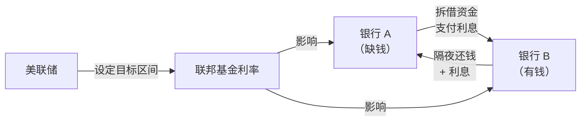
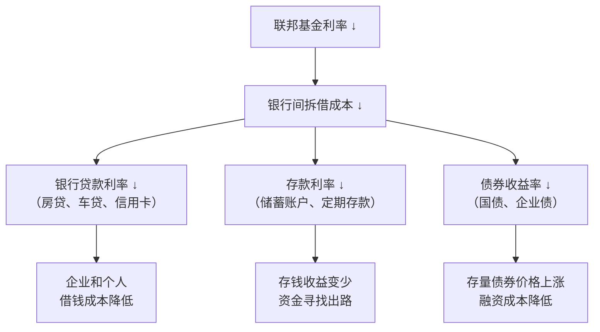
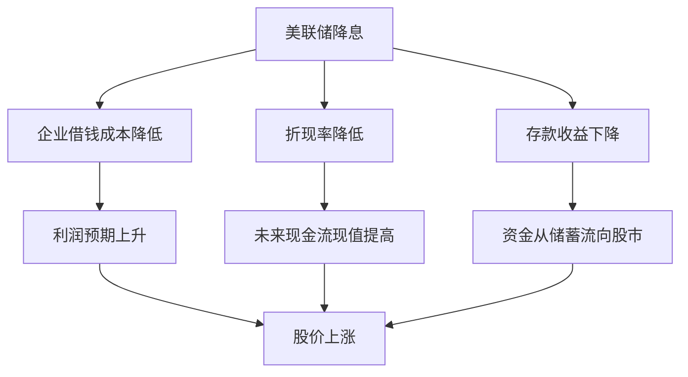
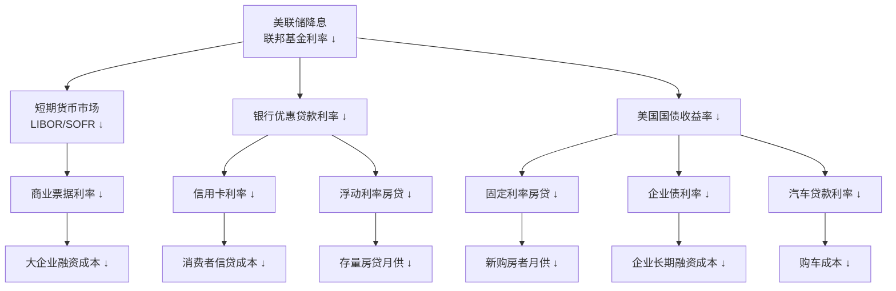
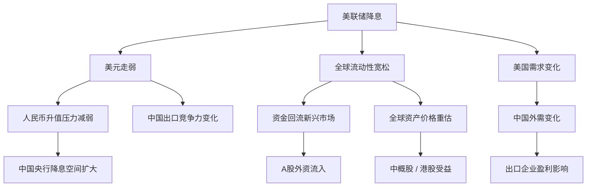
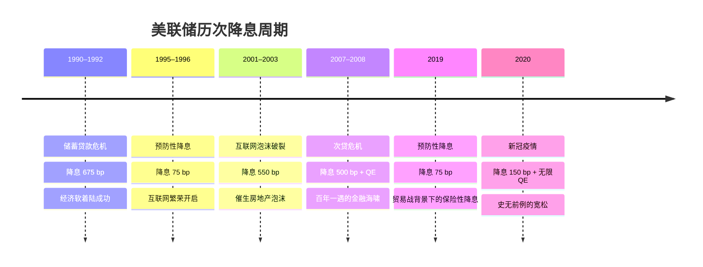
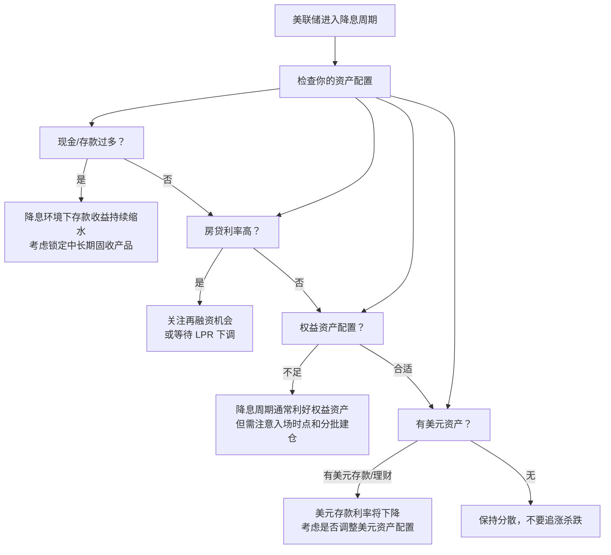
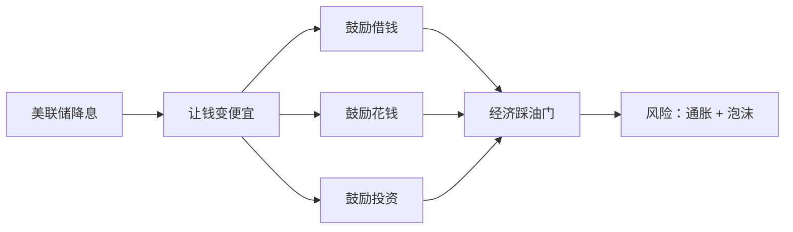

# 美联储降息是什么意思？一文讲透

## 一、美联储是谁？

**美联储（Federal Reserve，简称 Fed）** 是美国的中央银行。它的角色跟中国人民银行类似——掌管货币政策、调控经济冷热。但它只对美国经济负责，只不过因为美元是全球储备货币，它的每一个决定都会像多米诺骨牌一样传导到全世界。

美联储手里最重要的"温度调节器"叫做 **联邦基金利率（Federal Funds Rate）**。这不是你去银行贷款的利率，而是 **商业银行之间隔夜拆借资金的利率**。

通俗地说：银行 A 今天缺钱了，找银行 B 借一笔过夜钱周转一下，这个借贷的利息就是联邦基金利率。



## 二、"降息"到底降了什么？

美联储的"降息"就是 **调低联邦基金利率的目标区间**。比如：

```
之前：5.25% – 5.50%
降息 50 个基点后：4.75% – 5.00%

（1 个基点 = 0.01%，50 个基点 = 0.50%）
```

这个利率是一切利率的"地基"。它一降，整个利率大厦都会跟着往下沉：



所以"美联储降息"本质上是在让 **整个经济体系的资金成本变便宜**。

### 2.1 为什么贷款利率会跟着降？

这里的关键逻辑是：**银行的贷款定价 = 资金成本 + 信用风险溢价 + 运营成本 + 利润**。联邦基金利率下降，直接压低了银行的资金成本，这条传导链分两步走：

**第一步：银行的"进货价"变便宜了。**

银行放贷的钱从哪来？主要有三个渠道——客户存款、向其他银行拆借、向美联储直接借钱（贴现窗口）。联邦基金利率一降，银行间互相借钱的成本立刻降低，同时美联储的贴现率也会跟降。这相当于银行的"进货价"下降了。

**第二步：竞争压力迫使银行把降的成本让出去。**

如果只有一家银行融资成本降了，它可以闷声发大财——低成本借钱、高利率放贷，赚取更厚的息差。问题在于**所有银行同时享受了这个低成本**。当银行 A 把房贷利率从 6.5% 降到 6.2% 抢客户时，银行 B 不跟就得眼看着客户流失。一轮价格战下来，整个行业的贷款利率就都下来了。

```
银行的贷款利率定价逻辑：

  贷款利率 = 资金成本（联邦基金利率驱动） + 信用风险溢价 + 运营成本 + 目标利润
                  ↑
                  └── 降息直接压低这一项，给银行让出了降价空间
                  └── 同业竞争再把这个空间"逼"给了借款人
```

### 2.2 为什么存款利率也会跟着降？

这可能是最反直觉的部分——银行借钱成本降了，为什么我存钱的利息反而少了？逻辑是这样的：

**银行的存款利率不是"对客户的恩惠"，而是"对资金的竞争"。**

银行需要存款来放贷。当市场上资金紧张、银行间拆借利率很高时，银行为了吸收存款，必须开出更高的存款利率来吸引储户——"你不存我这，我就得花更贵的价格去跟别的银行借"。这就是为什么加息周期里你的储蓄账户利率也在涨。

降息之后，局面反转：

1. **替代品变便宜了。** 银行不再依赖高价揽储——如果客户不存钱，银行可以从同行那里以低得多的利率拆借到资金，甚至直接找美联储借。存款不再是唯一选择，"你不存就算了，我去市场上借更便宜"。
2. **贷款利率也在降，息差不能无限压缩。** 银行的利润来自贷款利息和存款利息的差额。如果贷款利率从 6% 降到了 5%，而存款利率还维持在 4%，息差只剩 1%，覆盖不了运营成本。所以银行必须把存款利率也往下调，以维持盈利空间。
3. **储户的议价能力变弱。** 当全市场的利率都在下行的环境中，储户找不到更高收益的替代品，议价能力变弱。

```
降息 → 存款利率下降的传导链：

  联邦基金利率 ↓
    → 银行间拆借成本 ↓（银行不依赖存款也能获得便宜资金）
      → 银行对存款的"渴求度"下降
        → 银行下调存款利率（你不存自然有人存，或者银行直接去市场上借）
          → 储户的利息收入缩水
```

### 2.3 用一家银行的一天来理解

把上面说的抽象逻辑放到一个具体的场景里：

> **模拟：降息前后，某商业银行资产负债部的决策**
>
> **降息前（联邦基金利率 5.50%）：**
> - 银行从同行拆借 1 亿的成本：5.50% 年化
> - 为了少依赖昂贵的拆借，银行大力吸收存款，开出了 4.50% 的存款利率
> - 放贷出去收 7.00%
> - 息差：7.00% − 4.50% = **2.50%**（用存款放贷） 或 7.00% − 5.50% = **1.50%**（用拆借放贷）
>
> **降息后（联邦基金利率 4.75%）：**
> - 银行从同行拆借 1 亿的成本：4.75% 年化（省了 0.75%）
> - 吸收存款的动力下降，把存款利率从 4.50% 降到 **3.80%**
> - 贷款利率在同行竞争下从 7.00% 降到 **6.50%**
> - 息差：6.50% − 3.80% = **2.70%**（用存款放贷） 或 6.50% − 4.75% = **1.75%**（用拆借放贷）
>
> **结论：** 降息后，贷款利率降了 0.50%，存款利率降了 0.70%，银行的息差反而从 2.50% 略扩到 2.70%。储户和借款人双输给了银行？不——借款人付出的利息绝对值变少了，储户只是收益缩水，银行赚的是一个更稳定但未必更大的息差。**真正赢的是整个经济——更便宜的资金意味着更多的投资和消费。**

### 2.4 一个常见的追问：美联储只控制银行间利率，凭什么管得了我的存款？

美联储并不直接规定你的存款利率。它做的是**改变整个银行体系的边际融资成本**——也就是银行多借一块钱需要付出的代价。当这个"边际成本"下降后，银行对所有资金来源的定价都会重新校准：

| 资金来源 | 降息前成本 | 降息后成本 | 变化原因 |
|----------|:--------:|:--------:|----------|
| 同业拆借 | 5.50% | 4.75% | 联邦基金利率直接挂钩 |
| 美联储贴现窗口 | 5.75% | 5.00% | 贴现率通常跟调 |
| 客户存款 | 4.50% | 3.80% | 银行不再需要高价抢存款 |
| 发行债券 | 5.80% | 5.00% | 国债收益率下行拉动 |

所有渠道的资金成本一起下降——这就是"地基"的含义。联邦基金利率这块地基下沉了，每一层楼都跟着往下沉。

## 三、为什么要降息？

降息通常发生在两种场景：

### 场景一：经济衰退风险（"救市"式降息）

经济增长放缓、失业率上升、企业投资意愿低迷。降息让借钱更便宜 → 企业愿意借钱扩产 → 创造就业 → 人们有工资去消费 → 企业赚钱 → 经济转起来。

> **典型案例：2020 年 3 月**
>
> 新冠疫情冲击全球，美联储在短短两周内两次紧急降息，将利率从 1.50%–1.75% 直接打到 0%–0.25%，并配合无限量 QE（量化宽松）。这是典型的"救市"式降息——不惜一切代价防止经济崩溃。

### 场景二：预防性降息（"软着陆"）

通胀已经控制住了，但利率太高会伤到经济。美联储提前小幅降息，在不过度刺激通胀的前提下给经济松绑。这就是市场上热议的"**软着陆**"剧本——在不引发衰退的情况下把经济从高空平稳降下来。


### 降息的触发信号

美联储决定是否降息，主要盯着以下几个指标：

| 指标 | 关注点 | 降息信号 |
|------|--------|----------|
| **PCE 物价指数** | 核心 PCE 是否接近 2% | 持续低于或接近 2% → 降息空间打开 |
| **非农就业** | 每月新增就业人数 | 持续走弱 → 就业市场需要刺激 |
| **失业率** | 是否明显上升 | 快速攀升 → 衰退风险加大 |
| **GDP 增速** | 经济增长是否减速 | 连续放缓 → 需要政策托底 |
| **金融市场** | 信贷条件是否过紧 | 银行"惜贷" → 需要降低资金成本 |

## 四、降息后会发生什么？

### 对股市 📈（通常利好，但非绝对）



**但注意区分两种降息：**

| 降息类型 | 股市反应 | 原因 |
|----------|----------|------|
| **预防性降息** | 通常上涨 | 经济基本面尚可，降息是"锦上添花" |
| **衰退式降息** | 可能暴跌 | 降息确认了"经济出了大问题" |

> **历史对比**
>
> - 1995 年预防性降息：美股随后两年大涨（互联网泡沫前夕）
> - 2001 年衰退式降息：降息 475 bp，纳斯达克依然暴跌 78%
> - 2007–2008 年衰退式降息：降息 500 bp，标普 500 腰斩

### 对债市 📉

- 新发债券的票面利率跟着降 → 存量老债券（锁定高利率）变得稀缺抢手 → **债券价格上涨**
- 降息周期中持有债券的人主要赚的是**价格上涨的钱**，而不是票息

### 对房市 🏠（利好）

- 房贷利率跟降 → 每月还款额减少 → 更多人买得起房 → 房价可能上涨
- 存量房贷业主的 **refinance（再融资）** 机会来了——把高利率房贷置换成低利率的，省下一大笔利息

### 对美元汇率 💵（通常贬值）

- 美元利率降低 → 持有美元资产的吸引力下降 → 资金流向高利率国家 → 美元贬值
- 人民币等新兴市场货币相对升值，进口商品变便宜

### 对黄金 🥇（通常利好）

黄金不生息，它的"敌人"是高利率——利率高时持有黄金的机会成本大（你放弃了存银行吃利息的收益）。利率降了，黄金的吸引力就回来了。加上美元贬值效应，黄金通常走强。

### 对大宗商品 🛢️

- 美元走弱 → 以美元计价的商品（石油、铜、铁矿石）价格倾向于上涨
- 降息刺激经济 → 工业需求预期增加 → 商品需求端利好

## 五、降息的传导机制：从美联储到你



整个传导链条有**时滞**——不是美联储一宣布降息你的房贷就立刻降。一般来说：

| 传导环节 | 反应速度 |
|----------|:--------:|
| 货币市场利率 | 即刻 |
| 短期贷款（信用卡、浮动利率） | 1–2 个月 |
| 长期贷款（固定利率房贷） | 3–6 个月 |
| 实体经济（企业投资、就业） | 6–18 个月 |

这就是为什么美联储要"走在曲线前面"——等经济数据已经恶化再降息，往往已经晚了。

## 六、降息 = 放水？——美联储的完整工具箱

降息只是美联储众多工具中最常规的一个。完整的"宽松工具箱"包括：

| 工具 | 机制 | 力度 |
|------|------|:----:|
| **降息** | 调低联邦基金利率目标 | ⭐⭐⭐ |
| **量化宽松（QE）** | 央行直接购买国债和 MBS，向市场注入流动性 | ⭐⭐⭐⭐⭐ |
| **前瞻指引** | 口头承诺"保持低利率直到 X 条件满足" | ⭐⭐ |
| **收益率曲线控制（YCC）** | 直接规定某个期限的国债收益率上限 | ⭐⭐⭐⭐ |
| **紧急贷款便利** | 向特定行业或机构提供定向资金 | ⭐⭐⭐ |

> **2020 年 3 月的美联储"王炸组合"**
>
> 1. 紧急降息 150 bp 至 0%–0.25%
> 2. 无限量 QE（每天购买 750 亿美元国债 + 500 亿美元 MBS）
> 3. 重启 2008 年金融危机时的一系列紧急贷款工具
> 4. 甚至破天荒地开始购买企业债 ETF
>
> 这一套组合拳下来，美联储资产负债表从 4 万亿膨胀到近 9 万亿美元。

## 七、对中国的溢出效应

美联储降息通过好几条管道传导到中国：



| 传导管道 | 影响方向 | 细节 |
| :--- | :--- | :--- |
| **汇率** | 美元走弱 → 人民币贬值压力减小 → 中国央行有更大降息空间 | 中美利差缩小，资本外流压力减轻 |
| **资本流动** | 美元资产收益下降 → 部分资金回流新兴市场（包括 A 股） | 北向资金可能加速流入 |
| **外需** | 美国经济如果因此避免衰退 → 中国出口需求稳定 | 利好制造业和出口企业 |
| **政策空间** | 中美利差缩小 → 中国货币政策受的掣肘减少 | 为降准降息创造条件 |
| **港股** | 港元挂钩美元，跟降 → 港股估值压力释放 | 对恒生指数和恒生科技构成利好 |

所以当你看到"美联储降息"的新闻时，它不只是一个美国事件——它意味着 **中国的降息窗口也可能打开**，进而影响你的房贷利率、理财收益、A 股走势，甚至人民币资产的全球吸引力。

## 八、历史上著名的降息周期



### 几条历史规律

1. **预防性降息（1995、2019）往往成功实现了软着陆**，美股在降息后表现良好。
2. **衰退式降息（2001、2007）无法阻止熊市**，因为基本面恶化比降息更强大。
3. **降息周期的终点往往是下一个泡沫的起点**——2001 年降息催生了房地产泡沫，2020 年降息催生了 2021 年的 meme 股狂潮和加密牛市。
4. **美联储总是在降息上"too late"**——加息加过头，等到数据明显恶化才慌忙降息。

## 九、降息周期中各资产的 historical 表现

基于过去六轮降息周期的平均表现：

| 资产 | 降息后 6 个月 | 降息后 12 个月 | 关键变量 |
|------|:------------:|:-------------:|----------|
| 美股（标普 500） | +5% ~ +15% | −10% ~ +20% | 是否衰退 |
| 美债（10 年期） | 价格上涨 3%–8% | 价格上涨 5%–12% | 降息幅度 |
| 黄金 | +8% ~ +20% | +15% ~ +30% | 实际利率 |
| 美元指数 | −3% ~ −8% | −5% ~ −12% | 相对利差 |
| 新兴市场股票 | +5% ~ +25% | −5% ~ +35% | 风险偏好 |
| 比特币 | 数据有限 | 数据有限 | 流动性 + 叙事 |

> ⚠️ **重要提醒**：过去的表现不代表未来。每一轮降息周期的宏观背景、通胀水平、地缘政治环境都不同。这些数字是统计归纳，不是预测。

## 十、常见的误区和陷阱

### 误区 1：「美联储降息 = 我的房贷马上降」

美联储利率影响的是方向，不是直接挂钩。你的房贷利率跟的是：

- **中国**：LPR（贷款市场报价利率），由中国人民银行调控
- **美国**：10 年期国债收益率 + 银行加点

传导需要时间，而且中间还有银行的"加点"缓冲——降息 50 bp 不代表你的房贷利率就降 50 bp。

### 误区 2：「降息一定利好股市」

如果降息是因为经济出了大问题（衰退式降息），股市反而可能暴跌。关键不在于"降不降"，而在于"为什么降"。

### 误区 3：「降息 = 通胀一定卷土重来」

不一定。如果需求端本身就很弱（经济衰退），便宜的钱也不一定会变成通胀——日本零利率几十年，依然通缩。通胀需要"钱多 + 货少"同时发生。

### 误区 4：「美联储一降息我就应该 all in 美股」

降息周期的初期往往是最危险的时刻——如果恰好碰上经济衰退，股市可能还有一大段下跌。历史表明，从第一次降息到市场真正见底，中间可能还隔了 6–12 个月。

### 误区 5：「加息是坏事，降息是好事」

对借款人来说降息是好事（利息少了）；对储户来说降息是坏事（利息收入少了）。对退休靠固定收益生活的人来说，降息意味着他们的存款和债券收入缩水。**好与坏取决于你站在哪个位置。**

## 十一、普通人该如何应对降息周期？



### 几条实操建议

| 建议 | 说明 |
|------|------|
| **别 panic，但也别 ignore** | 降息的影响是渐进的，不是一夜之间发生的。你有时间调整。 |
| **审视负债端** | 如果你有浮动利率贷款，降息周期会帮你省利息；如果有闲钱，可以考虑提前还一部分高息负债。 |
| **审视资产端** | 现金和存款的收益会越来越低，考虑是否需要将部分配置到债券、高股息股票等收益型资产。 |
| **不要试图 time the market** | "等降息了再买"往往不如"定投 + 长期持有"。市场的反应往往比你想象的快。 |
| **黄金可以作为压舱石** | 降息 + 美元走弱的环境通常利好黄金，作为组合的分散化工具是合理的。 |

## 十二、几个关键术语速查

| 术语 | 含义 |
|------|------|
| **联邦基金利率** | 美国商业银行之间隔夜拆借的利率，美联储的"政策利率" |
| **基点（bp）** | basis point，1 bp = 0.01%。降息 50 bp = 降 0.50% |
| **FOMC** | 联邦公开市场委员会，决定利率的机构，每年开 8 次会 |
| **点阵图** | FOMC 委员对未来利率的预测散点图，市场的"猜谜游戏" |
| **软着陆** | 加息把通胀打下来但不引发衰退，理想结局 |
| **硬着陆** | 加息加过头，经济直接跌入衰退 |
| **QE（量化宽松）** | 央行印钱买债券，比降息更猛的宽松手段 |
| **QT（量化紧缩）** | QE 的反向操作——央行缩表，回收流动性 |
| **实际利率** | 名义利率 − 通胀率，这才是真正影响资产价格的利率 |
| **中性利率（r\*）** | 既不刺激也不抑制经济的理论利率水平 |

## 十三、总结



**一句话版本：美联储降息 = 让钱变便宜，鼓励大家借钱、花钱、投资，给经济踩油门。** 副作用是钱变毛（通胀风险）、催生资产价格泡沫。

这是一种"用今天的宽松换明天的增长"的政策选择——而因为美元是世界货币，全世界都在同一辆车上。

理解美联储降息，不只是理解一个财经新闻标题，而是理解全球资本流动的底层逻辑、理解你的房贷为什么是这个利率、理解你的基金为什么涨跌，以及理解为什么昨天那个远在美国的决定，今天会让你的钱包有了微妙的变化。

---

*下次看到"美联储宣布降息 X 个基点"的推送时，你不再需要一脸茫然——你已经知道了它对你意味着什么。*
